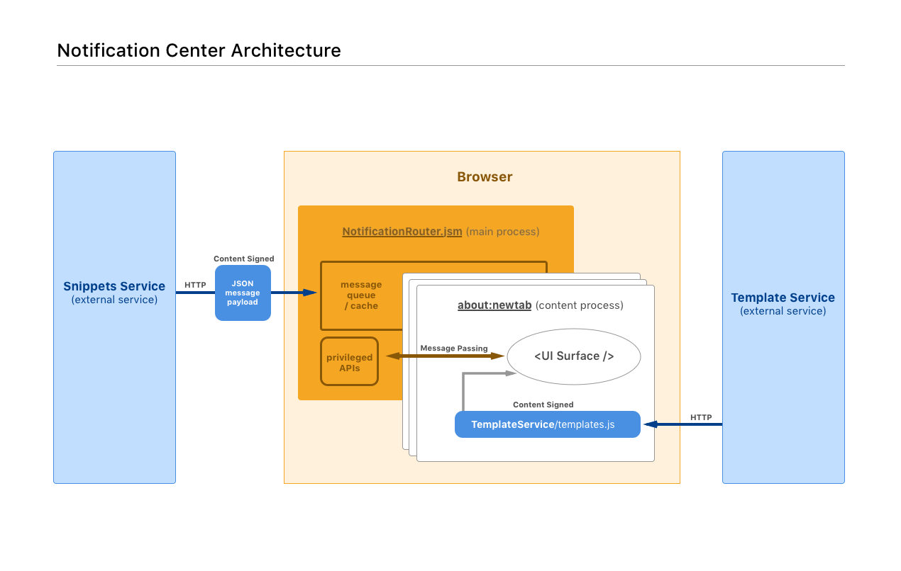

# Notification Center Prototype

This repository demonstrates a possible architecture for displaying messages in Firefox from the Snippets Server
and other sources.

## Running the prototype

```
npm install
npm start
```

## Components

- **firefox**: This represents client code shipped with Firefox
- **template-server**: A server providing js and css files for various templates
- **snippets-server**: This represents the snippets service, providing campaign data as an JSON-formatted array of campaigns

## Architecture



Our Firefox code, we include JS/CSS files from Template Server:

```html
<html>
<head>
  <link rel="stylesheet" href="https://template-server.mozilla.org/v60/templates.css">
</head>
<body>
  <script src="https://template-server.mozilla.org/v60/templates.js"></script>
</html>
```

This gives us access to a list of functions on the window object:

```js
window.NotificationCenterTemplates = {
  simple: ...
  special: ...
};
```

The NotificationCenter (in the main process of the browser) consumes notifications from the
Snippet Service as JSON and controls when messages are sent to the UI surface / rendered with
available templates.
